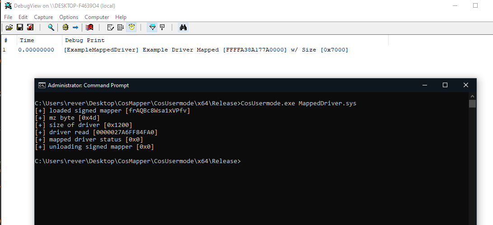

# CosMapper
Loads a signed kernel driver which allows you to map any driver to kernel mode without any traces of the signed / mapped driver.

## Procedure
1. The usermode program loads the signed driver 
2. The signed driver then does a [.data] hook on a ntoskrnl function to transfer the mapped driver buffer to kernel
3. Usermode process sends mapped driver bytes to driver to map and returns status to usermode.
4. MmUnloadedList PiddbCache and BigPoolAllocation are cleaned and the driver header is not mapped and no empty bytes for the header allocated.
5. The usermode program unloads the signed driver and deletes the service to remove final traces.

## Requirements
Your driver needs an entry like the example driver:

```
struct EntryInitialize
{
	std::uintptr_t mappedImageBase{};
	std::size_t mappedImageSize{};
};

NTSTATUS DriverEntry(EntryInitialize* entryParam)
{
	DebugPrint("Example Driver Mapped [%p] w/ Size [0x%x]", entryParam->mappedImageBase, entryParam->mappedImageSize);

	ExFreePool(reinterpret_cast<void*>(entryParam));

	return STATUS_SUCCESS;
}
```
The current example passes a structure with the image base and size of the mapped driver but it can be modified to your own liking.



Note: this project was coded in 3 days so it might have some bugs (open ticket)<br />
The project has been tested on ``Windows 10 20H2``

## Usage

```cosmapper.exe driver.sys```
